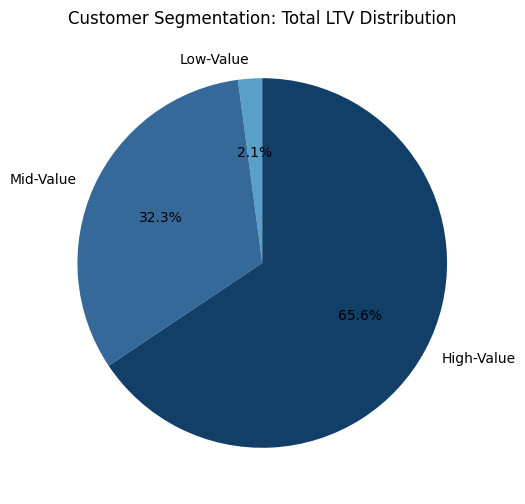

# Intermediate SQL - Sales Analysis

## Overview
Analysis of customer behavior, retention, and lifetime value for an e-commerce company to improve customer retention and maximize revenue.

## Business Questions
1. **Customer Segmentation Analysis:** Who are our most valuable customers?
2. **Cohort Analysis:** How do different customer groups generate revenue?
3. **Retention Analysis:** Which customers haven't purchased recently?

## Analysis Approach

### 1. Customer Segmentation Analysis
- Aggregate lifetime value per customer by summing net revenue, then use percentiles (25th and 75th) to set thresholds.
- Assign customers into three groups based on these thresholds: low, mid, and high value.
- Summarize total LTV for each segment to compare contribution across groups

💻 Query: [1_customer_segmentation.sql](/1_customer_segmentation.sql)

**📈 Visualization:**

📊 **Key Finding:**
- High-value customers generate about ($135.4M) in total LTV, making up 65.6 percent of total revenue.
- Mid-value customers contribute around ($66.6M), which is 32.3 percent of total LTV.
- Low-value customers add only ($4.3M), representing 2.1 percent of total LTV. 

💡 **Business Insights**
- High-Value (66% revenue): Offer premium membership program to 12,372 VIP customers.
- Mid-Value (32% revenue): Create upgrade paths for 24,743 customers through personalized promotions, with potential $66.6M → $135.4M revenue opportunity.
- Low-Value (2% revenue): Design re-engagement campaigns for 12,372 customers to increase purchase frequency.

### 2. Cohort Analysis
- Tracked revenue and customer count per cohorts
- Cohorts were grouped by year of first purchase
- Analyzed customer retention at a cohort level

💻 Query: [2_cohort_analysis.sql](/2_cohort_analysis.sql)

**📈 Visualization:**

📊 **Key Finding:**
- Customer revenue peaked around 2015–2017 and has declined steadily since 2019, showing a downward trend in average revenue per customer for newer cohorts.
- The most recent cohorts (2023–2024) generate the lowest average revenue, below $2,200 per customer
- NOTE: This trend suggests retention or spending habits are weakening in recent years and may require strategic changes to sustain revenue growth.

💡 **Business Insights**
- Revenue per customer was strongest for cohorts from 2015 to 2019, indicating these years brought in higher-value customers.
- Cohorts from 2020 onward show a steady decline in revenue, pointing to reduced customer spending or lower-value acquisitions.
- If the downward trend continues, future cohorts will likely generate less than $2,000 per customer, signaling an urgent need to reassess acquisition and retention strategies.

{Repeat for each analysis approach}

### 2. Customer Retention
- Identify each customer’s last purchase date and classify them as Active or Churned based on a 6-month window.
- Group customers by their cohort year to compare retention and churn across different acquisition periods.
- Calculate the share of Active vs Churned customers within each cohort to measure retention performance over time.

💻 Query: [3_retention_analysis.sql](/3_retention_analysis.sql)

**📈 Visualization:**

📊 **Key Findings:**
- Across all cohorts, churned customers consistently represent about 90 to 92 percent of the total.
- Active customers make up only 8 to 10 percent of each cohort, with slight improvement in 2022 and 2023.
- Despite growth in total customers in later cohorts, retention rates have not significantly improved.

💡 **Business Insights**
- Retention strategies need urgent focus, as the majority of customers stop purchasing within 6 months.
- The recent small increase in active customers suggests potential impact from newer engagement efforts, which should be reinforced.
- Segmenting and targeting high-risk cohorts for retention campaigns could help reduce churn and increase long-term value

{Repeat for each analysis approach}

## Strategic Recommendations
- **Grow and Protect Revenue**
    - Keep top customers engaged with loyalty rewards, early access, and personal offers.
    - Help mid-value customers grow by giving them tailored bundles or upsell options.
    - Improve the first-year experience so new customers spend more early on.

- **Reduce Customer Churn**
    - Build strong follow-ups and reminders within the first six months.
    - Personalize communication to keep customers active and connected.
    - Test different approaches by cohort and expand what works best.
    - Offer win-back campaigns for customers showing early signs of churn, such as targeted discounts or check-in messages.

## Technical Details
- **Database:** PostgresSQL
- **Analysis Tools:** PostgresSQL
- **Visualization:** Python, Jupyter Notebook